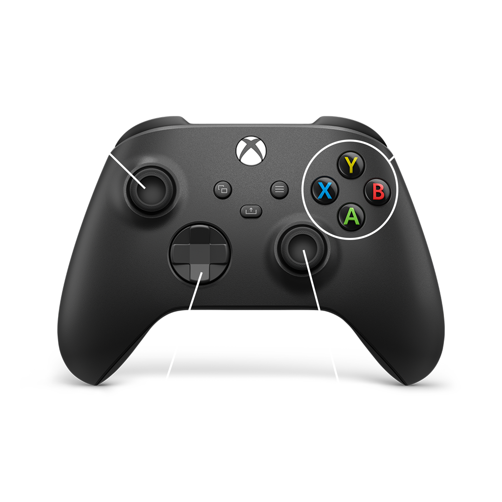

# Cutie-Tanks

This is a arcade game where the last one alive wins.  
The players play as very cute tanks, and can shoot an unlimited amount of bullets / bombs at eachother.  
A player can only take 10 damage before dying. The last one standing wins. Matches are around 1 to 2 minutes and very chaotic. For now there are 3 levels to choose from, but I plan on making some more.

[Play on itch.io](https://robijntje.itch.io/cutie-tanks)

Also, there are skins. To join a game press down on the player select screen, and then use down to select a skin.

## Installation

The game can be installed on Linux trough [Lutris](https://lutris.net/) and there is also an AUR package available for Arch Linux.

[Download using Lutris](https://lutris.net/games/cutietanks/)

The [AUR package](https://aur.archlinux.org/packages/cutie-tanks/) can be installed using an AUR helper like `yay` or `paru`:


```
yay -S cutie-tanks
```

## Development

Make sure you have parcel and nodejs installed:

```
npm install -g parcel-bundler
```

The game uses Phaser 3 Scenes for the different "states" the game can be in. These are:

- **Loading:**  
for loading all the assets
- **Main menu:**  
to connect controllers and display the logo
- **Player select:**  
to join the game and select a skin
- **In-Game:**  
to play the game
- **Winner:**  
shows the winner (the last one standing)

Run `npm start` to test. Run `npm build` to package for production.

## Controls
The game is designed with a xbox controller in mind, but any controller should work. To move use the left analog stick. To aim use the right analog stick. To shoot use the analog right trigger.


